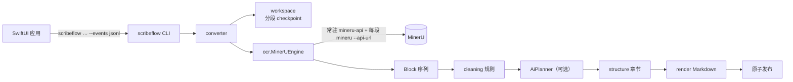

# 架构

## 总览

设计上只有两条约束贯穿全部代码：

1. **Block 是唯一的文档表示。** OCR 引擎产出 Block，之后的清洗、结构分析、渲染只消费 Block。换 OCR 引擎只需实现 `OcrEngine` 协议。
2. **正文不可改写。** 清洗只能提议 `Drop` / `Merge` / `SetLevel` 三种操作，由 `apply_operations` 统一校验、执行、审计。合并只允许相邻正文段落，拼接时只调整连接处的空白和英文连字符。

## Python 模块

| 模块 | 职责 |
|---|---|
| `domain.py` | `Block`、`Kind` |
| `ocr/engine.py` | `OcrEngine` 协议、`OcrSettings`、`SegmentJob` |
| `ocr/mineru.py` | MinerU 适配器：服务生命周期、客户端调用、错误分类、崩溃重试 |
| `ocr/mineru_format.py` | MinerU `content_list` → Block，复制图片 |
| `ocr/process.py` | 子进程在独立进程组中运行，取消时整组终止 |
| `cleaning/operations.py` | 操作类型、校验执行、审计 |
| `cleaning/rules.py` | 确定性规则（每条规则一个类） |
| `cleaning/ai.py` | AI 规划器、响应解析、按内容哈希缓存 |
| `structure.py` / `render.py` | 章节切分、Markdown 渲染 |
| `workspace.py` | 未完成任务的状态文件、分段块、日志 |
| `converter.py` | `convert` 与 `reprocess` 两个流程、原子发布 |
| `events.py` | 进度事件与 JSON Lines 输出 |
| `cli.py` | 参数解析、SIGTERM → 取消 |

### 转换流程

1. 校验输入；输出已存在且未指定 `--overwrite` 时立即失败（在 OCR 之前）。
2. 打开工作区 `.<输出名>.scribeflow-work/`。已有工作区且 PDF 哈希、分段大小、OCR 参数一致则续跑，否则报 `workspace_conflict`。
3. 启动 OCR 引擎（所有分段都已完成时不启动），逐段：切出分段 PDF → 识别 → 写入 `blocks/sNNN.jsonl` → 更新 `job.json`。
4. 合并全部分段的 Block，依次运行清洗规则和可选的 AI 规划器。
5. 在暂存目录中生成 Markdown、manifest、审计，硬链接图片与 OCR 原始结果，再整体改名为输出目录；替换旧输出时先改名备份，失败则恢复。
6. 删除工作区。

`reprocess` 从输出目录的 `.scribeflow/blocks.jsonl` 开始执行第 4、5 步。

### MinerU 集成

MinerU 3.4.4 的 `mineru` 命令在没有 `--api-url` 时，每次都会启动并关闭一个临时 `mineru-api` 服务，模型随之重新加载。ScribeFlow 在任务开始时启动一个服务（`python -m mineru.cli.fast_api --host 127.0.0.1 --port <空闲端口>`），等待 `/health` 返回 healthy，然后每段调用 `mineru … --api-url <服务地址>`。服务端在进程内以线程执行任务，模型单例常驻，所以整本书只加载一次模型。

- 客户端输出 `Failed to query task status`，或服务进程已退出时，重启服务并重试该分段一次。
- 客户端输出 `Timed out waiting for result of task` 时报 `ocr_timeout`。单段超时默认 `max(3600, 300 × 页数)` 秒；设置了 `MINERU_TASK_RESULT_TIMEOUT_SECONDS` 时以它为准。
- `--no-shared-server` 退回每段临时服务的旧行为。

## 事件协议

后端每行输出一个 JSON 对象，`event` 字段区分类型：

| event | 字段 |
|---|---|
| `stage` | `stage`（prepare / ocr / clean / ai / render / publish）、`message` |
| `started` | `input`、`output`、`page_count`、`segment_count`、`resumed`、`version` |
| `segment` | `index`、`count`、`start_page`、`end_page`、`state`（running / done / skipped） |
| `diagnostics` | `section`（ocr / ai）、`values`（字符串字典） |
| `completed` | `output`、`document`、`markdown_files`、`chapters`、`log`、`warnings` |
| `failed` | `code`、`message`、`resumable`、`log` |

`failed.code` 取值：`invalid_input`、`output_exists`、`workspace_conflict`、`ocr_unavailable`、`ocr_failed`、`ocr_timeout`、`ocr_server`、`ai_config`、`ai_failed`、`cancelled`、`internal`。

协议样例是 [`app/Tests/ScribeFlowCoreTests/Resources/events.jsonl`](../app/Tests/ScribeFlowCoreTests/Resources/events.jsonl)。Python（`tests/test_events.py`）和 Swift（`BackendEventTests`）的测试都以它为准，任何一侧改动协议都会让另一侧的测试失败。

## macOS 应用

`app/` 是一个 SwiftPM 包：

- `ScribeFlowCore`（只依赖 Foundation）：事件解码、`BackendCommand` 参数构造、`BackendProcess`（stdout 事件 / stderr 日志 / 退出码，取消时 SIGTERM，20 秒后 SIGKILL）、`ConversionProgress`（纯值类型的状态机）。
- `ScribeFlow`（SwiftUI）：`AppModel` 连接界面与后端进程；偏好用 `@AppStorage`，API 密钥用钥匙串。

应用包内的 Python 位于 `Contents/Resources/runtime/python`，依赖位于 `runtime/site-packages`。开发时设置环境变量 `SCRIBEFLOW_PYTHON=<仓库>/.venv/bin/python` 后 `swift run`，即可用源码中的后端运行界面。

## 测试

- `tests/test_cli.py`：以子进程运行真实 CLI，并用伪造的 `mineru` / `mineru-api` 程序覆盖共享服务、服务崩溃重启、失败续跑、SIGTERM 取消（确认不留下子进程）。
- `tests/test_converter.py`：进程内伪造引擎；`tests/fixtures/expected/` 是 6 页样例书的期望输出。清洗或渲染行为有意改变时，用 `UPDATE_GOLDEN=1 uv run pytest tests/test_converter.py` 更新并检查差异。
- `app/Tests`：协议解码、命令参数、行缓冲、状态机、进程运行与取消。
